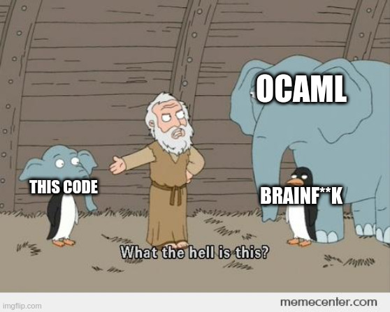

# Branefrick

My attempt at writing a purely functional Brainfuck interpreter in OCaml
using the zipper datastructure

## TODO:

- ~~Implement a commandline program~~ ***DONE as of 3/24/2025**
- Maybe make the code cleaner 
- Write tests to prove that this works
